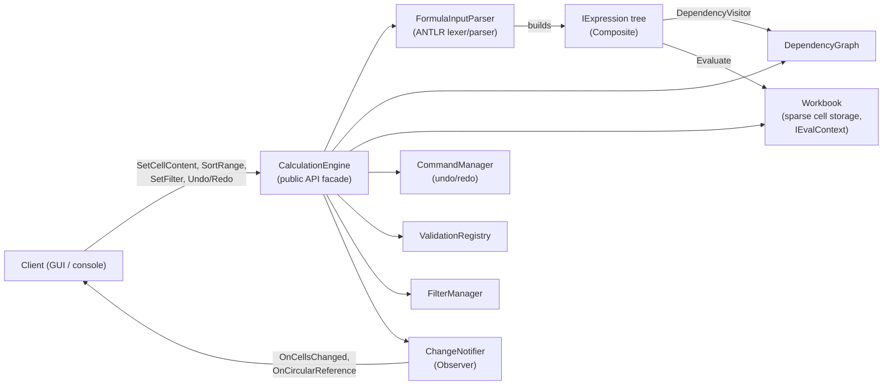
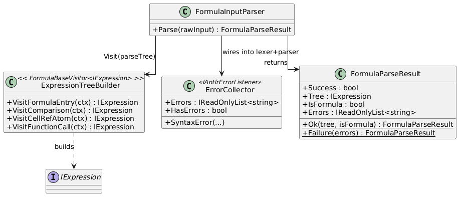
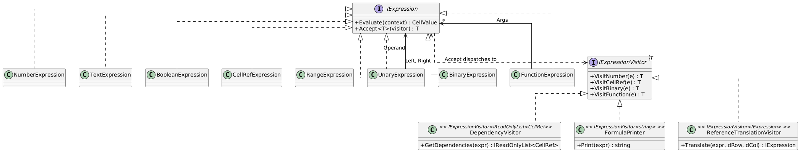
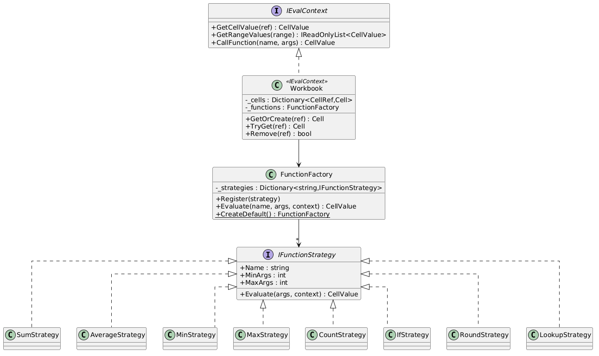
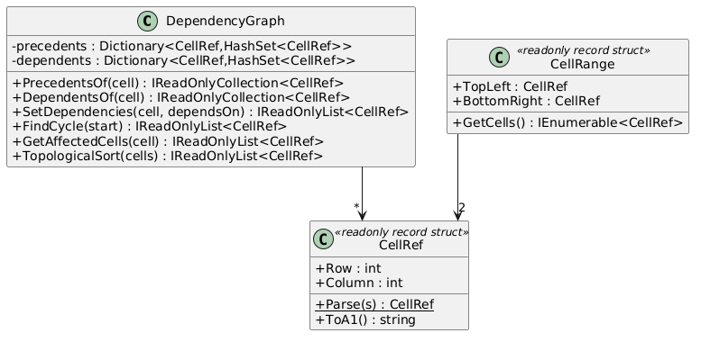
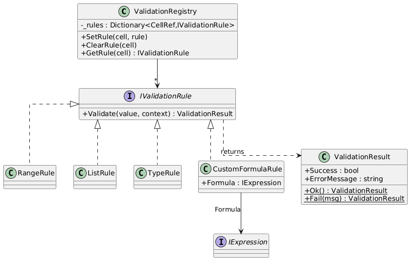
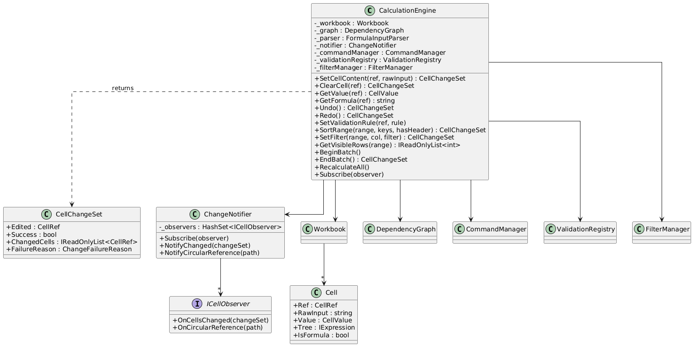

# CalcGraph — Design Portfolio

This document is the design record for CalcGraph, a spreadsheet
calculation engine (`CalcEngine.Core`) with a WinForms demonstration
client (`CalcEngine.Gui`). It covers the formal grammar, the class
structure of each module, the ADT specifications (abstraction
functions and representation invariants) for the data structures the
brief singles out, a semantics reference table, and the design
decisions made along the way — including the ones later found to be
wrong and fixed (§7).

1. [Architecture overview](#1-architecture-overview)
2. [Formal grammar](#2-formal-grammar)
3. [Class diagrams](#3-class-diagrams)
4. [ADT specifications](#4-adt-specifications)
5. [Semantics reference](#5-semantics-reference)
6. [Design decisions and trade-offs](#6-design-decisions-and-trade-offs)
7. [Known gaps, found during this write-up](#7-known-gaps-found-during-this-write-up)

---

## 1. Architecture overview

A calculation engine is a pipeline with a graph at its centre: formula
text goes in, an expression tree comes out, the tree's dependencies are
recorded in a graph, and a change to any cell walks that graph to find
everything that must be recomputed, in the right order.



`CalcEngine.Core` has no reference to `CalcEngine.Gui` in either
direction — `CalculationEngine` is a standalone class library API; the
GUI is one possible client of it, not a dependency of it.

---

## 2. Formal grammar

Source of truth: `CalcEngine.Core/Grammar/Formula.g4`, an ANTLR4
combined grammar. Restated here as EBNF with the precedence ladder
explicit, loosest-binding first:

```
formula      ::= '=' expr | literal
expr         ::= comparison
comparison   ::= comparison ('=' | '<>' | '<' | '<=' | '>' | '>=') addition
               | addition
addition     ::= addition ('+' | '-') multiply
               | multiply
multiply     ::= multiply ('*' | '/') unary
               | unary
unary        ::= ('-' | '+') unary
               | atom
atom         ::= NUMBER | STRING | BOOLEAN | CELLREF | RANGE
               | functionCall
               | '(' expr ')'
functionCall ::= FUNCNAME '(' ( arg (',' arg)* )? ')'
arg          ::= RANGE | expr
literal      ::= NUMBER | STRING | BOOLEAN

BOOLEAN      ::= 'TRUE' | 'FALSE'
RANGE        ::= LETTERS DIGITS ':' LETTERS DIGITS
CELLREF      ::= LETTERS DIGITS
FUNCNAME     ::= [A-Z] [A-Z0-9_.]*
NUMBER       ::= DIGITS ('.' DIGITS)? ([eE] [+-]? DIGITS)?
STRING       ::= '"' (~["] | '""')* '"'
LETTERS      ::= [A-Z]+
DIGITS       ::= [0-9]+
WS           ::= [ \t\r\n]+   (skipped)
```

No production for unary `^` (exponentiation) or absolute references
(`$A$1`) exists — the brief requires arithmetic, comparison, and
parentheses, not exponentiation, and the absence of absolute references
is a deliberate simplification with consequences documented in §6
(sorting).

### 2.1 Lexer ambiguity — resolved explicitly

`FUNCNAME`'s character class (`[A-Z][A-Z0-9_.]*`) is a superset of what
`CELLREF` (`LETTERS DIGITS`) and `BOOLEAN` (`'TRUE' | 'FALSE'`) can
match — every valid cell reference and both boolean keywords are also
syntactically valid function names. ANTLR resolves lexer ambiguity two
ways, and both are load-bearing here:

- **Longest match wins.** `RANGE` (`B2:B45`) is always longer than the
  `CELLREF` prefix alone (`B2`), so a range never gets tokenized as a
  cell reference followed by stray `:B45`.
- **Earliest-declared rule wins ties.** For an equal-length match —
  `A1` matches both `CELLREF` and `FUNCNAME` at length 2; `TRUE`
  matches both `BOOLEAN` and `FUNCNAME` at length 4 — the rule declared
  first in `Formula.g4` wins. The grammar declares `BOOLEAN`, `RANGE`,
  and `CELLREF` before `FUNCNAME`, in that order, specifically so a
  cell reference is never misread as a call to a function named `A1`,
  and `TRUE`/`FALSE` are never misread as calls to functions named
  `TRUE`/`FALSE`. `SUM`, having no digit suffix, cannot match `CELLREF`
  at all, so it is unambiguously `FUNCNAME` regardless of declaration
  order.

### 2.2 Error reporting

`ErrorCollector` implements both `IAntlrErrorListener<int>` (lexer:
unrecognized characters) and `IAntlrErrorListener<IToken>` (parser:
unexpected tokens, missing brackets), replacing ANTLR's default
console-printing listener. Every message is `Line {n}:{col} {msg}` —
positional, not just "syntax error" — satisfying the brief's "tell the
user what is wrong and where" requirement. `FormulaInputParser.Parse`
never lets a syntax error, or a semantically-invalid-but-syntactically-
valid reference (§7.1), escape as a .NET exception; both come back as
`FormulaParseResult.Failure`.

---

## 3. Class diagrams

### 3.1 Parsing


### 3.2 Expression tree (Composite + Interpreter)



Three visitors, three jobs, one tree: `DependencyVisitor` (Pass 1 —
extract `CellRef`s for the graph), `FormulaPrinter` (serialise back to
formula text — needed by `SortRangeCommand` and the GUI formula bar),
`ReferenceTranslationVisitor` (clone with every reference shifted —
`SortRangeCommand`'s Option B move semantics, §6.3).

### 3.3 Evaluation and functions (Strategy + Factory)


`IfStrategy` is the one strategy that does not evaluate every argument
up front — `Evaluate` receives unevaluated `IExpression` args precisely
so `IF` can evaluate the condition, then exactly one branch (§5.3).

### 3.4 Dependency graph


### 3.5 Commands (undo/redo)


### 3.6 Data validation (Group C feature)


### 3.7 Sorting and filtering (Group C feature)


### 3.8 Engine facade


---

## 4. ADT specifications

### 4.1 The expression tree (`IExpression`)

**AF(node)** = the value obtained by interpreting `node` as a formula
subexpression: for a leaf, the literal, cell reference, or range it
denotes; for a branch, the result of applying its operator or function
to the values of `AF` applied to its children, under whatever
`IEvalContext` `Evaluate` is called with.

**Representation invariant:**

1. Every concrete node type implements exactly one `IExpressionVisitor<T>`
   dispatch (`Accept` calls its own `VisitX`, never another type's).
2. `CellRefExpression.Ref` has `Row >= 1` and `Column >= 1` (enforced
   in the constructor; see §7.1 for why this alone was not sufficient).
3. `RangeExpression.Range` satisfies `CellRange`'s own invariant
   (`TopLeft <= BottomRight`, componentwise). **Not** invariant: that a
   range only appears as a function argument — the grammar's `atom`
   rule admits a bare `RANGE` anywhere any atom is legal, so
   `=B2:B5+1` parses; `RangeExpression.Evaluate` returning `#VALUE!`
   is what makes that case well-defined rather than a parse error
   (§7 corrects an earlier, incorrect version of this invariant found
   in the code's own comments).
4. `BinaryExpression`/`UnaryExpression`/`FunctionExpression` never hold
   a `null` operand or argument (constructor-checked).
5. The tree built by `ExpressionTreeBuilder` from a given parse is
   immutable thereafter — no `IExpression` node has a mutating method.

**Key operations:**

- `Evaluate(context)`: **pre** — `context` is non-null and answers
  `GetCellValue`/`GetRangeValues`/`CallFunction` for whatever the tree
  references. **post** — returns `AF(this)` under `context`; never
  throws for a type error, a missing reference, or a division by zero
  — those come back as `CellValue.FromError(...)` (§5.2).
- `Accept<T>(visitor)`: **post** — returns `visitor.VisitX(this)` for
  this node's own concrete type `X`.

### 4.2 `DependencyGraph`

**AF(g)** = a directed graph `(V, E)` where `V` is every `CellRef` that
has ever appeared as a dependency source or target, and an edge
`u -> v` means "`v`'s formula reads `u`, so `u` must be recomputed
before `v`."

**Representation:** two mirrored adjacency maps —
`precedents: CellRef -> HashSet<CellRef>` (u's that v depends on) and
`dependents: CellRef -> HashSet<CellRef>` (v's that depend on u).

**Representation invariant:**

1. `u ∈ precedents[v] ⟺ v ∈ dependents[u]` for every `u`, `v` — the two
   maps always agree; every mutation (`AddEdge`, `RemoveIncomingEdges`)
   updates both in the same call.
2. The graph is acyclic **after** any call to `SetDependencies` returns
   successfully (`null`) — a call that would introduce a cycle detects
   it via `FindCycle` and restores the prior edge set before returning
   the cycle path, so an in-progress edit can never leave the graph
   cyclic even transiently from an external caller's point of view.
3. No self-loops survive a successful `SetDependencies` — a
   self-reference (`A1 = A1+1`) is exactly a one-node cycle and is
   caught by the same `FindCycle` check.

**Why two maps, not one:** `precedents` makes dropping a formula's old
edges `O(d)` in the number of the cell's own old dependencies, not
`O(E)` over the whole graph — this is what keeps `SetDependencies`
cheap on every edit, not just the first one.

**Key operations:**

- `SetDependencies(cell, dependsOn)`: **pre** — none (any `IEnumerable<CellRef>`,
  including empty). **post** — if the new edge set would create a
  cycle reachable from `cell`, the graph is left exactly as it was
  and the cycle path is returned (entry cell first and last); otherwise
  `cell`'s incoming edges are replaced with `dependsOn` and `null` is
  returned.
- `GetAffectedCells(cell)`: **post** — every cell reachable from `cell`
  by following `dependents` edges, direct or indirect, each exactly
  once (a diamond dependency does not appear twice), excluding `cell`
  itself.
- `TopologicalSort(cells)`: **pre** — `cells` is a subset of `V` with
  no edges leaving it that matter (Kahn's algorithm is restricted to
  the induced subgraph on `cells`). **post** — an ordering of `cells`
  such that for every edge `u -> v` with both endpoints in `cells`, `u`
  precedes `v`.

### 4.3 `Workbook`

**AF(w)** = the partial function `CellRef -> CellContents`, where an
absent key denotes an empty cell whose value is `CellValue.Empty`.
`CellContents` is `(RawInput, Value, Tree?)`.

**Representation:** `Dictionary<CellRef, Cell>` — sparse, not a 2D
array; a workbook with 3 occupied cells out of a notional 100,000×26
grid allocates 3 `Cell` objects, not 2,600,000.

**Representation invariant:**

1. A key present in `_cells` has a non-null `Cell` whose `Ref` equals
   that key.
2. `Cell.IsFormula == (Cell.Tree is not null)`; a cell is a literal or
   a formula, never both — `SetLiteral` clears `Tree`, `SetFormula`
   sets it.
3. `Workbook` never creates an entry on a read path (`TryGet`,
   `GetCellValue`, `GetRangeValues`) — only `GetOrCreate` (the write
   path) grows `_cells`, so evaluating a formula can never silently
   grow the workbook.

**Key operations:**

- `GetCellValue(ref)`: **post** — `TryGet(ref)?.Value ?? CellValue.Empty`;
  total over every `CellRef`, including ones never written.
- `Remove(ref)`: **post** — the entry at `ref` no longer exists;
  subsequent `GetCellValue(ref)` returns `Empty`. Does not touch the
  dependency graph — `CalculationEngine` sequences both (§4.5).

### 4.4 `CommandManager`

**AF(m)** = the pair `(history, future)` where `history` is
`undoStack` read oldest-first (operations still undoable) and `future`
is `redoStack` read top-first (operations undone and available to
reapply).

**Representation:** `LinkedList<ICommand>` used as a bounded deque for
`undoStack` (`First` = oldest, `Last` = most recent — `O(1)` push/pop
at both ends), plain `Stack<ICommand>` for `redoStack`.

**Representation invariant:**

1. `undoStack.Count <= 100`; pushing a 101st command evicts the oldest
   (`RemoveFirst`) rather than growing unbounded.
2. Every command in `undoStack` has been `Execute`d exactly once (more
   precisely: last acted on via `Execute`, possibly after being
   `Undo`ne and `Execute`d again on redo) and holds whatever state it
   needs to invert itself.
3. `ExecuteCommand` only pushes to `undoStack` when `command.Execute()`
   reports success — a rejected edit, a rejected sort, never enters
   undo history.
4. After any successful `ExecuteCommand`, `redoStack` is empty — a new
   edit invalidates whatever was available to redo, the same rule
   every editor with linear undo history follows.

### 4.5 `CalculationEngine.ApplyEdit` — the operation the other ADTs compose under

Not an ADT on its own, but the specification that ties §4.1–4.4
together, and the one place their invariants must be kept jointly
consistent:

**Sequence, per edit:** parse → (if formula) extract dependencies →
`DependencyGraph.SetDependencies` (cycle-checked, rolled back on
failure) → evaluate the candidate value against the *current* workbook
state → (if a rule is attached) validate the candidate, rolling back
the just-accepted graph edges to the *true* prior edges on rejection
(§7.2) → write to `Workbook` → recompute everything
`DependencyGraph.GetAffectedCells` reports, in
`DependencyGraph.TopologicalSort` order → notify observers once with
the complete `CellChangeSet`.

**Postcondition on failure (parse error, circular reference, or
validation rejection):** the workbook, the dependency graph, and the
undo stack are exactly as they were before the call. This is the
invariant `SortRangeCommand`'s own rollback (§6.3) is built on top of.

---

## 5. Semantics reference

The brief calls out type errors, missing references, and division by
zero as things that must come back as error values "the way a
spreadsheet does." This table is the specification the hidden test
suite is presumably checking against, and the one the test suite in
this repo checks against explicitly.

| Situation | Result | Where |
|---|---|---|
| Number ÷ 0 | `#DIV/0!` | `BinaryExpression.Divide` |
| Text operand in `+ - * /` | `#VALUE!` | `BinaryExpression.ArithOp`/`Divide` |
| Empty cell operand in arithmetic | Coerced to `0` | `CellValue.AsNumber` |
| Boolean operand in arithmetic | `TRUE`→`1`, `FALSE`→`0` | `CellValue.AsNumber` |
| Comparison operators (`= <> < <= > >=`) | Always `Boolean` | `BinaryExpression.Compare` |
| Text vs text comparison | Ordinal, case-insensitive | `BinaryExpression.Compare` |
| Text vs non-text comparison | Text always compares greater | `BinaryExpression.Compare` |
| Error operand anywhere in a `BinaryExpression`/`UnaryExpression` | That error propagates unchanged (left error wins if both sides are errors) | `BinaryExpression.Evaluate` |
| Unknown function name | `#NAME?` | `FunctionFactory.Evaluate` |
| Argument count outside `[MinArgs, MaxArgs]` | `#VALUE!` | `FunctionFactory.Evaluate` |
| `COUNT` | Counts `Number` and `Boolean` values only; `Text` and `Empty` are not counted; an `Error` argument propagates | `CountStrategy` |
| `SUM`/`AVERAGE`/`MIN`/`MAX` argument that is `Text` | `#VALUE!` | respective strategies |
| `AVERAGE` of zero numeric arguments (e.g. an all-text or empty range) | `#DIV/0!` | `AverageStrategy` |
| `MIN`/`MAX` of zero numeric arguments | `#VALUE!` (the "or `#VALUE!`" branch the project plan left as a choice — chosen and tested) | `MinStrategy`/`MaxStrategy` |
| `ROUND(number, digits)` | `Math.Round(number, digits, MidpointRounding.AwayFromZero)` — half away from zero, not banker's rounding | `RoundStrategy` |
| `LOOKUP(searchValue, range)` | **Exact-match** linear scan over `range` in order; numbers compared numerically, text case-insensitively; first match wins; `#N/A` if none match. See §6.4 for why this is exact match, not Excel's approximate "largest value ≤ search" semantics. | `LookupStrategy` |
| `IF(cond, a, b)` | `cond` evaluated first; exactly one of `a`/`b` evaluated — never both (§5.3) | `IfStrategy` |
| Reference to a cell outside the sheet (row or column < 1) | `FormulaParseResult.Failure` (grammar accepts the token; `CellRef.Parse`/`CellRefExpression`'s constructor reject the value; §7.1 makes this a graceful parse failure rather than a crash) | `FormulaInputParser.Parse` |
| A `RANGE` used where a scalar is expected (e.g. `=B2:B5+1`, not as a direct function argument) | `#VALUE!` — parses successfully; §7 corrects an earlier claim that this was rejected at parse time | `RangeExpression.Evaluate` |
| Circular reference (direct, indirect, or self: `A1=A1+1`) | Edit rejected; `CellChangeSet.Circular` carries the exact cycle, e.g. `A1, B3, C7, A1` | `DependencyGraph.FindCycle` |

### 5.1 Cross-type sort order (`CellValueOrdering`, Group C feature)

Ascending rank, lowest first: **`Number` < `Text` < `Boolean` < `Empty`
< `Error`**. Within a kind: numeric comparison for `Number`; ordinal
case-insensitive comparison for `Text`; `false` before `true` for
`Boolean`. `Empty` compares equal to `Empty`; `Error` further orders by
`ErrorKind` purely so the sort has a total order — which error sorts
before which is not meaningful to a user and is not asserted on.
`DescendingComparer` is defined as the exact negation of
`AscendingComparer`, not an independently specified order (tested:
`Descending(a,b) == -Ascending(a,b)`, always).

### 5.2 Error model

`CellValue` is a five-state tagged union (`ValueKind`: `Empty`,
`Number`, `Text`, `Boolean`, `Error`), and `ErrorKind` has six values:
`DivideByZero`, `Value`, `Reference`, `Name`, `Circular`,
`NotAvailable`. Every operator and function checks its operand kinds
before touching the payload; an `Error` operand short-circuits
(propagates unchanged) before any arithmetic or coercion happens. No
`IExpression.Evaluate` implementation, and no `IFunctionStrategy.Evaluate`
implementation, throws for a value-level problem — the only exceptions
that can occur during evaluation are programmer errors (null
arguments), not data errors, and those are constructor-time guards, not
`Evaluate`-time behaviour.

### 5.3 `IF` laziness

`IfStrategy.Evaluate` receives `IReadOnlyList<IExpression>` — the
**unevaluated** argument trees — because `FunctionExpression.Args` are
never pre-evaluated by the caller (`FunctionExpression.Evaluate` just
forwards `Args` to `context.CallFunction`). `IfStrategy` evaluates
`args[0]` (the condition) first, then exactly one of `args[1]`/`args[2]`.
This is what makes `=IF(A1=0, 0, 10/A1)` return `0` when `A1` is `0`,
instead of `#DIV/0!` from eagerly evaluating the untaken branch — the
project plan calls this out by name as "a classic," and it is tested
(`FunctionStrategyTests`).

---

## 6. Design decisions and trade-offs

### 6.1 Range dependencies: materialise, don't index

`=SUM(B2:B45)` expands to 44 dependency edges (`DependencyVisitor.VisitRange`),
not one block-level edge. Simple, obviously correct, and — per
`docs/benchmarks.md` — fast enough in practice (a 100,000-cell workbook
with a 500-edge chain propagates in ~1ms, recomputes fully in ~19ms,
both far under target) that the more complex block/region-indexing
alternative was never needed. The cost is memory proportional to total
edge count rather than to block count; not measured directly, but the
benchmark's ~20MB managed-heap delta for 100,000 cells (499 of them
with edges) suggests it is not the bottleneck at this scale.

### 6.2 Validation timing: reject the raw edit, don't re-validate computed drift

`SetValidationRule` attaches a rule to a cell; every future edit's
*evaluated candidate value* is checked before anything is written
(§4.5). A cell whose formula result later drifts out of range because
a dependency changed is **not** re-checked — `CalculationEngine` has no
`FindInvalidCells()` sweep (that is a documented gap, §7.3, not a
silent one). This keeps validation out of the recalculation hot path:
`RecomputeAffected`/`EndBatch` never consult `ValidationRegistry`.

### 6.3 Sorting: move semantics (Option B), not copy semantics

`SortRangeCommand` moves whole rows — raw content, not just computed
values — and translates every cell reference inside a moved formula by
that row's own move delta (`ReferenceTranslationVisitor`), regardless
of whether the reference points inside or outside the sorted range.
This is Excel's actual *move* (cut-paste) behaviour, not its *copy*
behaviour, and it is the direct answer to "what happens when I sort a
range containing `=A1+1`?": if that row moves from row 5 to row 10,
the formula becomes `=A6+1`, shifted by the same `+5` the row itself
moved by. Because the grammar has no absolute references, translation
is uniform — there is nothing to pin in place, which is a
simplification worth stating plainly rather than treating as
incidental.

**The failure mode this creates, and how it's handled:** a formula
that references a row near the top of the sheet, moved further up,
can require a reference row `< 1`. `CellRefExpression`'s constructor
throws for that. Rather than let the exception escape `SortRange`
(found and fixed during this session — see §7.4), planning happens
entirely before any cell is written, and a translation that would go
out of bounds causes the whole sort to be refused as a
`CellChangeSet.ParseFailure` with nothing written — the same
all-or-nothing guarantee §4.5 gives a single rejected edit.

### 6.4 `LOOKUP`: exact match, not approximate match

The project plan's suggested semantics for `LOOKUP` — return the
result matching the largest lookup value ≤ the search value, assuming
the lookup vector is sorted ascending — is Excel's real behaviour but
depends on a precondition (`sorted ascending`) the engine has no way
to verify and the caller has no way to declare. The implementation
instead does an exact-match linear scan, returning the first value
equal to the search value (§5, table). This is a narrower function
than Excel's `LOOKUP`, stated as a deliberate trade-off: it is fully
specified without an unenforceable precondition, and it fails loudly
(`#N/A`) rather than returning a silently wrong "nearest" answer when
the vector turns out not to be sorted.

### 6.5 Batching: `BeginBatch`/`EndBatch`, not per-cell events

`SortRangeCommand` writes every destination cell through the same
`ApplyEdit` path a single edit uses (so cycle detection and validation
are never duplicated or bypassed for a bulk operation), but defers
`RecomputeAffected`/`NotifyChanged` until the outermost `EndBatch`,
which unions every edited root's affected set, sorts it once, evaluates
once, and notifies once. Moving N cells costs one topological sort, not
N — required for the 50ms/2s targets to mean anything once sorting is
in the picture, and the mechanism the project plan's own interface
contract calls for ahead of building the Group C features on top of it.

### 6.6 Filtering: a view, never an edit

`FilterManager` never writes to `Workbook`, `DependencyGraph`, or a
cell's value — `GetVisibleRows` only reads. The one temptation
deliberately refused: making an aggregate function (`SUM` etc.) skip
hidden rows, which would make the engine's computed results depend on
GUI view state — a `SUBTOTAL`-style function taking visibility as an
explicit argument is the correct way to add that behaviour later,
never an aggregate becoming visibility-aware implicitly.

---

## 7. Known gaps, found during this write-up

Writing the ADT specifications against the actual code (not against
memory of what the code was supposed to do) surfaced two real bugs and
one stale invariant claim, all fixed and covered by regression tests
in the same session:

**7.1 — Cell references with row 0 crashed the client.** The `CELLREF`
grammar token (`LETTERS DIGITS`) accepts any digit string as a row,
including `0`. `=A0+1` therefore parsed successfully at the ANTLR
level; `ExpressionTreeBuilder` then called `CellRef.Parse("A0")`, which
throws `FormatException` — uncaught, all the way out of
`CalculationEngine.SetCellContent` to the client. Fixed in
`FormulaInputParser.Parse` by catching `FormatException`/`ArgumentException`
around tree-building and converting to `FormulaParseResult.Failure`.
Regression tests: `FormulaParserTests.CellReferenceWithRowZero_FailsGracefully_NeverThrows`,
`RangeWithRowZero_FailsGracefully_NeverThrows`.

**7.2 — A rejected validation edit didn't actually roll back the
dependency graph.** `ApplyEdit`'s rollback read
`_graph.PrecedentsOf(cellRef)` **after** `SetDependencies` had already
installed the new (about-to-be-rejected) edges, so the "restore" was a
no-op — the graph ended up believing the cell depended on whatever the
rejected formula referenced, while the cell's actual stored content
never changed. Fixed by capturing `previousDeps` before the tentative
`SetDependencies` call. Regression test:
`CalculationEngineValidationTests.SetCellContent_RejectedFormulaEdit_DependencyGraphKeepsThePriorFormulasEdges`
(observes the graph state indirectly through the public API: only an
edit to the cell the graph should still depend on causes a recompute).

**7.3 — `RangeExpression`'s doc comment claimed an invariant the
grammar doesn't enforce.** It stated a range "appears only as a direct
function argument, never as an operand of a `BinaryExpression` or
`UnaryExpression`." Empirically, `=B2:B3+1` parses and evaluates to
`#VALUE!` — the grammar's `atom` rule admits a bare `RANGE` anywhere
any atom is legal. Corrected in the source comment and in §4.1 above.

**7.4 — `SortRange` could throw instead of failing gracefully.** See
§6.3. Regression test:
`CalculationEngineSortAndFilterTests.SortRange_TranslationWouldGoOutsideSheet_IsRejectedNotThrown_AndLeavesWorkbookUnchanged`.

**Still open, not fixed (documented, not hidden):**

- `ErrorKind.Reference` (`#REF!`) is defined and has a display string,
  but no code path currently produces it — the engine has no fixed
  upper bound on sheet size, so "reference outside the sheet" only
  triggers on the *lower* bound (row/column `< 1`, §7.1), never an
  upper one, unlike a real spreadsheet's fixed grid.
- `FindInvalidCells()` (§6.2) does not exist — a cell whose computed
  value drifts out of its rule's range via a dependency change is not
  currently surfaced to the client at all.
